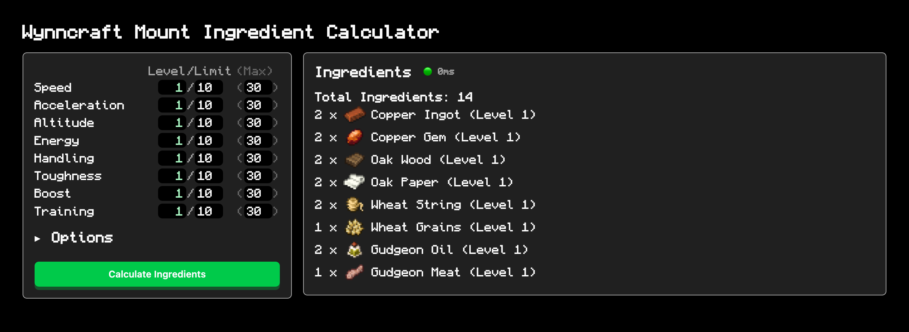

# Wynncraft Mount Ingredient Calculator

Optimal feeding calculator for leveling up
[Mounts](https://wynncraft.wiki.gg/wiki/Mounts)
on Wynncraft. The feeding problem is modeled as
an integer linear programming problem, and solved
using [glpk.js](https://github.com/jvail/glpk.js/).

## Limitations

- At the moment, ingredient cost = level of the ingredient.
  A future change could change the cost to be the
  trade-market cost, or another more accurate heuristic.
- This solver does not take into account that feeding time
  depends on the average limit, meaning this solver may
  not produce an optimal time/cost tradeoff when the average
  limit is less than 20.

